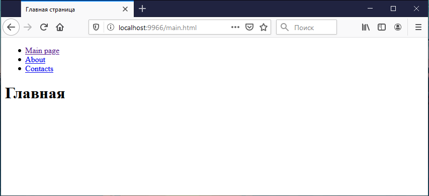

# Как организовать работу с HTML

В качестве языка шаблонов используется [Nunjucks](https://mozilla.github.io/nunjucks/)

Он удобен тем, что похож на шаблонизаторы, которые используются на бэкенде, и работает именно с тегами, в отличие например от Pug.
Это значит, что не придется учить новый язык — по сути вы работаете с HTML, к которому добавилось несколько дополнительных фишек.

Точка входа — `./src/pages`. Каждый njk-файл в корне скомпилируется в одноименную HTML-страницу. Файлы, которые начинаются с нижнего пробела (`_layout.njk`), не компилируются.

## Делаем каркас

Чтобы познакомиться с базовыми возможностями, сделаем простой прототип. Создайте несколько файлов такой структуры:

    ./src/pages
        /components
            top_menu.njk
        _layout.njk
        about.njk
        index.njk
        main.njk

about.njk — страница "О нас", main.njk — главная страница, а в index.njk разместим список сверстанных страниц, чтобы удобно было показывать заказчику.

Файл `_layout.njk` — это каркас, общий для всех страниц.

Файл `components/top_menu.njk` — это верхнее меню сайта, которое мы выносим в отдельный файл для красоты.
Там же могут быть какие-то другие повторяющиеся компоненты, например малая карточка товара или еще что-то.

## layout

Общий каркас для всех страниц пока пусть выглядит максимально просто (никаких скриптов и стилей, только разметка):

    <!DOCTYPE html>
    <html>
    <head>
        <meta charset="utf-8">
        <meta name="viewport" content="width=device-width, initial-scale=1, shrink-to-fit=no">

        <title>
            
                Верстка проекта - заголовок по-умолчанию
            
        </title>

        <!-- тут будут стили -->
    </head>
    <body>

        

        
        

        <!-- тут будут скрипты -->
    </body>
    </html>

Здесь нам интересна директва include — понятно, что она просто подключает какой-то файл.

Директива block определяет некий блок верстки, который может быть переопределен в других файлах. Например тут это блоки title и content.

## Верхнее меню

Просто кусочек разметки, который взят из документации Bootstrap 4:

    <ul class="nav">
        <li class="nav-item">
            <a class="nav-link active" href="main.html">Main page</a>
        </li>
        <li class="nav-item">
            <a class="nav-link" href="about.html">About</a>
        </li>
        <li class="nav-item">
            <a class="nav-link disabled" href="#" tabindex="-1" aria-disabled="true">Contacts</a>
        </li>
    </ul>

## Страницы

Покажу пример главной страницы main.njk, остальные страницы работают по аналогии:

    

    
    Главная страница
    

    
        <h1>Главная</h1>
    

В начале пишем, что страница расширает общий каркас — extends layout.

Дальше переопределяем блок title.

Дальше прописываем содержимое блока content. Все очень просто.

## Собираем воедино

Чтобы все собралось, выполняем команду

    npm run dev-server

Когда все скомпилируется, открываем в браузере http://localhost:9966/main.html и видим главную страницу, которая пока состоит только из меню и заголовка:

Дальше все в ваших руках.
