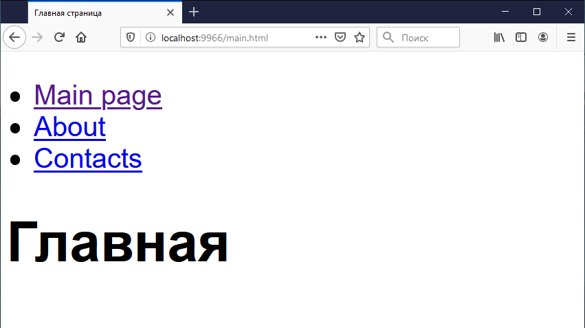

# Как организовать работу с CSS

Общий принцип работы с CSS уже описан внутри файлов SCSS/LESS, а так же показана примерная архитектура расположения стилей.
Все, что нам остается - выбрать, какой препроцессор мы будем использовать, и переместить соответствующие файлы на уровень, что и папка, в которой содержатся файлы стилей.

Например, мы выбрали SCSS, поэтому из всех папок SCSS мы переносим файлы с расширением .scss на уровень выше:
    
    # ./src/styles/mixins/scss/_variables.scss => ./src/styles/mixins/_variables.scss
    
Затем указываем правильные пути к стилям в файле `./src/styles/main.scss`.
Если мы выбрали SCSS, то следует удалить: папки, содержащие в себе `.less` файлы, и `./src/styles/main.less`

Дальше идет не самый очевидный момент. Чтобы сборка узнала об этом файле, его необходимо подключить в общей точке входа в приложение.
Это файл `./src/main.js`. Именно его сканирует сборщик — webpack, чтобы скомпилировать приложение. Подключение происходит так:

    # ./src/main.js
    import "@styles/main.scss";

Сокращение `@styles` указывает на директорию `./src/styles`.

Все стили, подключенные в `./src/main.js` соберутся в два файла: `./dist/css/main.css` (стили сайта) и `./dist/css/vendors.css` (стили импортированные из node_modules).

Чтобы сразу увидеть результат, его нужно подключить в html-документе. Сделаем это в `./src/pages/_layout.njk`:

    <link rel="stylesheet" type="text/css" href="css/vendors.css">
    <link rel="stylesheet" type="text/css" href="css/main.css">

Далее выполняем сборку:

    npm run dev-server

И убеждаемся, что стили применились:

