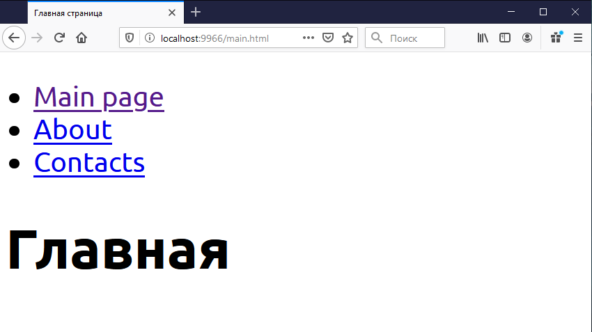

# Как подключить шрифт с Google Fonts

Проще всего — через import.

Находим точку входа стилей — `./src/styles/main.scss` — и прописываем в начало ссылку на шрифт. Получится примерно так:

    @import url('https://fonts.googleapis.com/css?family=Ubuntu:400,700&display=swap&subset=cyrillic-ext');
    html, body {
        font-family: Ubuntu, sans-serif;
        font-size: 40px;
    }

Пересобираем, проверяем:

